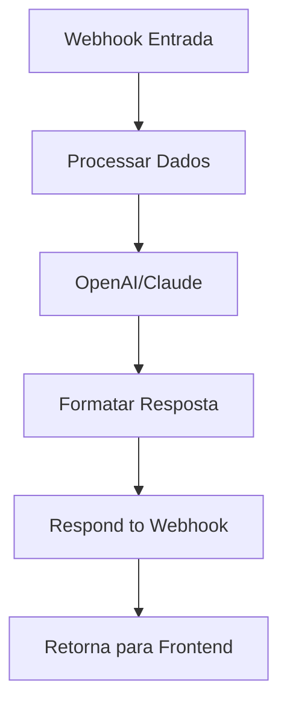

# ⚡ Configuração n8n - Resposta Síncrona

## 🎯 Objetivo

Configurar o n8n para retornar a resposta da IA diretamente na requisição HTTP, eliminando a necessidade de webhook server local.

## 🔧 Configuração no n8n

### 1. **Webhook de Entrada**

**Configurações do Nó Webhook:**
- **HTTP Method**: `POST`
- **Path**: `/therapist-ai` (ou manter o atual)
- **Authentication**: None
- **Response Mode**: `Response Node` ⚠️ **IMPORTANTE**
- **Response Data**: `All Entries`

### 2. **Processamento com IA**

**Nó OpenAI (ou Claude/Gemini):**
- **Operation**: `Chat`
- **Model**: `gpt-4` ou `gpt-3.5-turbo`
- **Messages**: Configure o prompt do terapeuta

**Exemplo de Prompt:**
```
Você é um terapeuta especializado no protocolo 5P (Presença, Propósito, Positividade, Progresso, Potencial).

Contexto do usuário:
- Nome: {{$json.user.name}}
- Progresso: {{$json.context.userProgress}}
- Personalidade: {{$json.context.onboardingResults}}

Mensagem: {{$json.message}}

Responda de forma empática e prática, oferecendo sugestões baseadas no protocolo 5P. Seja conciso mas útil.
```

### 3. **Resposta Síncrona (CRUCIAL)**

**Adicione um nó "Respond to Webhook" no final do workflow:**

**Configurações:**
- **Response Code**: `200`
- **Response Headers**: 
  ```json
  {
    "Content-Type": "application/json"
  }
  ```

**Response Body (JSON):**
```json
{
  "response": "{{$('OpenAI').first().json.choices[0].message.content}}",
  "suggestions": [
    "Continue praticando o protocolo 5P",
    "Mantenha o foco na gratidão",
    "Lembre-se de respirar profundamente"
  ],
  "exercises": [
    "Exercício de respiração 4-7-8",
    "Meditação de 5 minutos"
  ],
  "userId": "{{$json.user.id}}",
  "conversationId": "{{$json.conversationId}}",
  "timestamp": "{{new Date().toISOString()}}"
}
```

## 🔄 Fluxo do Workflow



## 📝 Estrutura de Dados

### **Entrada (do Frontend):**
```json
{
  "message": "Como posso melhorar minha ansiedade?",
  "user": {
    "id": "user-123",
    "name": "João Silva",
    "email": "joao@email.com"
  },
  "context": {
    "dailyProtocol": { "completed": false },
    "userProgress": { "streak": 5, "level": 2, "xp": 150 },
    "onboardingResults": { "personality": "introvertido" }
  },
  "conversationId": "conv_1234567890_user-123",
  "timestamp": "2025-01-03T02:25:14.333Z",
  "platform": "essential-factor-5p"
}
```

### **Saída (para Frontend):**
```json
{
  "response": "Para melhorar a ansiedade, recomendo começar com exercícios de respiração...",
  "suggestions": [
    "Pratique respiração profunda por 5 minutos",
    "Use a técnica de grounding 5-4-3-2-1",
    "Mantenha um diário de gratidão"
  ],
  "exercises": [
    "Exercício de respiração 4-7-8",
    "Meditação mindfulness de 10 minutos"
  ],
  "userId": "user-123",
  "conversationId": "conv_1234567890_user-123",
  "timestamp": "2025-01-03T02:25:20.456Z"
}
```

## 🧪 Teste da Configuração

### **Teste Manual no n8n:**
1. Execute o workflow manualmente
2. Use dados de teste na entrada
3. Verifique se a resposta é retornada corretamente

### **Teste via cURL:**
```bash
curl -X POST https://fator5ps.app.n8n.cloud/webhook-test/a95c2946-75d2-4e20-82bf-f04442a5cdbf \
  -H "Content-Type: application/json" \
  -d '{
    "message": "Como posso melhorar minha ansiedade?",
    "user": {
      "id": "test-user",
      "name": "Teste",
      "email": "teste@email.com"
    },
    "context": {
      "userProgress": { "level": 1, "streak": 0 }
    },
    "conversationId": "conv_test_123",
    "timestamp": "2025-01-03T12:00:00.000Z",
    "platform": "essential-factor-5p"
  }'
```

**Resposta Esperada:**
```json
{
  "response": "Para melhorar a ansiedade...",
  "suggestions": [...],
  "exercises": [...],
  "userId": "test-user",
  "conversationId": "conv_test_123",
  "timestamp": "2025-01-03T12:00:05.123Z"
}
```

## ⚠️ Pontos Importantes

### **1. Response Mode**
- **DEVE** ser `Response Node`
- **NÃO** use `Immediately` ou `When Last Node Finishes`

### **2. Timeout**
- Configure timeout adequado no n8n (60-120 segundos)
- IA pode demorar para processar

### **3. Tratamento de Erros**
- Adicione nós de tratamento de erro
- Retorne resposta de fallback em caso de falha

### **4. Rate Limiting**
- Configure limites se necessário
- Evite spam de requisições

## 🔍 Debug e Logs

### **Logs Importantes:**
- Execução do workflow no n8n
- Resposta da IA (OpenAI/Claude)
- Tempo de processamento
- Erros de timeout ou API

### **No Frontend:**
- Console: `📤 Enviando mensagem para terapeuta AI`
- Console: `✅ Resposta síncrona do terapeuta AI`

## 📋 Checklist Final

- [ ] Webhook configurado com Response Mode = "Response Node"
- [ ] Nó de IA configurado e testado
- [ ] Nó "Respond to Webhook" adicionado no final
- [ ] Estrutura JSON da resposta correta
- [ ] Timeout adequado configurado
- [ ] Teste manual no n8n realizado
- [ ] Teste via cURL bem-sucedido
- [ ] Frontend atualizado (já feito)
- [ ] Logs de debug habilitados

## 🚀 Vantagens da Nova Configuração

✅ **Simplicidade**: Sem webhook server local
✅ **Confiabilidade**: Resposta direta
✅ **Performance**: Sem polling ou delays
✅ **Manutenção**: Menos componentes
✅ **Debug**: Mais fácil de debugar

---

**🎯 Resultado:** Chat funcionando diretamente com n8n, sem necessidade de infraestrutura adicional!