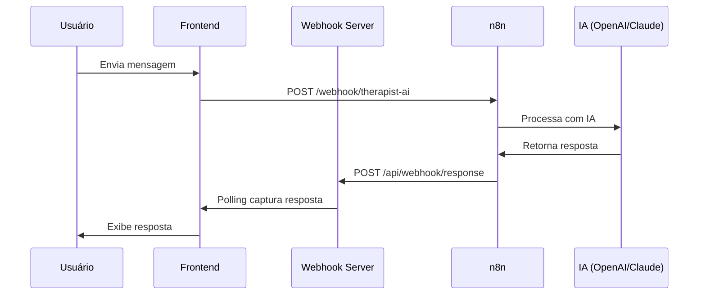

# 🔗 Configuração do n8n para Integração com TherapistAI

## 📋 Visão Geral

Para que o chat do TherapistAI funcione corretamente com o n8n, você precisa configurar um workflow bidirecional que:
1. **Receba** mensagens do frontend via webhook
2. **Processe** a mensagem com IA (OpenAI, Claude, etc.)
3. **Envie** a resposta de volta para o webhook server local

## 🛠️ Configuração Necessária no n8n

### 1. **Webhook de Entrada (Receber Mensagens)**

**Nó: Webhook**
- **HTTP Method**: `POST`
- **Path**: `/therapist-ai` (ou qualquer path de sua escolha)
- **Authentication**: None (ou configure conforme necessário)
- **Response Mode**: `Immediately`

**Estrutura de Dados Esperada:**
```json
{
  "message": "Como posso melhorar minha ansiedade?",
  "user": {
    "id": "user-123",
    "name": "João Silva",
    "email": "joao@email.com"
  },
  "context": {
    "dailyProtocol": { "completed": false },
    "userProgress": { "streak": 5, "level": 2, "xp": 150 },
    "onboardingResults": { "personality": "introvertido" }
  },
  "conversationId": "conv_1234567890_user-123",
  "timestamp": "2025-01-03T02:25:14.333Z",
  "platform": "essential-factor-5p",
  "responseWebhook": "http://localhost:3001/api/webhook/response"
}
```

### 2. **Processamento com IA**

**Nó: OpenAI (ou Claude/Gemini)**
- **Operation**: `Chat`
- **Model**: `gpt-4` ou `gpt-3.5-turbo`
- **Messages**: Configure o prompt do terapeuta

**Exemplo de Prompt:**
```
Você é um terapeuta especializado no protocolo 5P (Presença, Propósito, Positividade, Progresso, Potencial).

Contexto do usuário:
- Nome: {{$json.user.name}}
- Progresso: Nível {{$json.context.userProgress.level}}, {{$json.context.userProgress.streak}} dias de sequência
- Personalidade: {{$json.context.onboardingResults.personality}}

Mensagem do usuário: {{$json.message}}

Responda de forma empática e prática, oferecendo sugestões baseadas no protocolo 5P.
```

### 3. **Webhook de Resposta (Enviar de Volta)**

**Nó: HTTP Request**
- **Method**: `POST`
- **URL**: `{{$json.responseWebhook}}` (usa a URL enviada na requisição)
- **Headers**:
  ```json
  {
    "Content-Type": "application/json"
  }
  ```

**Body (JSON):**
```json
{
  "response": "{{$json.choices[0].message.content}}",
  "suggestions": [
    "Continue praticando o protocolo 5P",
    "Mantenha o foco na gratidão",
    "Lembre-se de respirar profundamente"
  ],
  "exercises": [
    "Exercício de respiração 4-7-8",
    "Meditação de 5 minutos"
  ],
  "userId": "{{$json.user.id}}",
  "conversationId": "{{$json.conversationId}}",
  "timestamp": "{{new Date().toISOString()}}"
}
```

## 🔧 Configuração no .env.local

Certifique-se de que sua URL do webhook n8n está correta:

```env
VITE_N8N_WEBHOOK_URL=https://seu-n8n.com/webhook/therapist-ai
```

## 🧪 Testando a Integração

### 1. **Teste Manual no n8n**
- Execute o workflow manualmente
- Verifique se todos os nós estão funcionando
- Confirme que a resposta está sendo enviada para o webhook local

### 2. **Teste via Interface**
- Acesse: `http://localhost:5173/admin/webhook-test`
- Use o "Webhook Tester" para testar a integração completa
- Verifique os logs no console do navegador

### 3. **Verificar Logs**
- **Frontend**: Console do navegador (F12)
- **Webhook Server**: Terminal onde `node webhook-server.cjs` está rodando
- **n8n**: Logs de execução do workflow

## 🚨 Problemas Comuns e Soluções

### **Problema 1: Webhook não recebe resposta**
**Solução:**
- Verifique se o `responseWebhook` está correto na requisição
- Confirme que o webhook server está rodando na porta 3001
- Teste a conectividade: `curl http://localhost:3001/api/webhook/response`

### **Problema 2: CORS Error**
**Solução:**
- Configure CORS no n8n se necessário
- Verifique se o webhook server tem CORS habilitado (já configurado)

### **Problema 3: Timeout**
**Solução:**
- Aumente o timeout no n8n (padrão: 30s)
- Otimize o prompt da IA para respostas mais rápidas
- Use modelos mais rápidos (gpt-3.5-turbo vs gpt-4)

### **Problema 4: Estrutura de dados incorreta**
**Solução:**
- Verifique se o JSON de resposta segue exatamente a estrutura esperada
- Use o "Function" node no n8n para formatar os dados se necessário

## 📊 Monitoramento

### **Logs Importantes:**
1. **Frontend**: `📨 Processando resposta do webhook`
2. **Webhook Server**: `🔔 Webhook response recebida do n8n`
3. **n8n**: Status de execução do workflow

### **Métricas a Acompanhar:**
- Tempo de resposta da IA
- Taxa de sucesso das requisições
- Erros de timeout
- Qualidade das respostas

## 🔄 Fluxo Completo



## 📞 Suporte

Se ainda houver problemas:
1. Verifique os logs em todas as etapas
2. Teste cada componente isoladamente
3. Use o WebhookTester para debug
4. Confirme que todas as URLs estão corretas

---

**✅ Checklist de Configuração:**
- [ ] Webhook de entrada configurado no n8n
- [ ] Nó de IA configurado e testado
- [ ] Webhook de resposta configurado
- [ ] URL do n8n atualizada no .env.local
- [ ] Webhook server rodando (porta 3001)
- [ ] Frontend rodando (porta 5173)
- [ ] Teste completo realizado